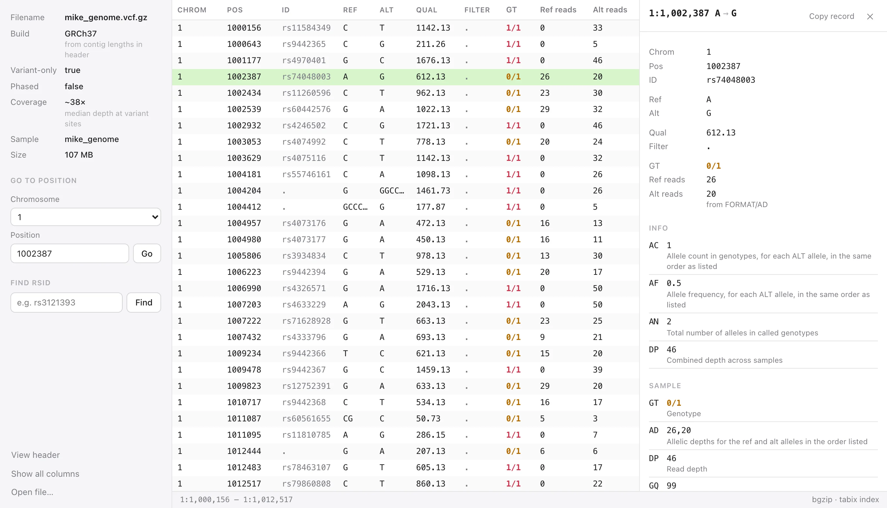

# VCF Lite

A small, fast desktop viewer for VCF files. Open a file and read it — no command line needed.



## Install

Download the latest version for your system from the [website](docs/index.html) or the [Releases page](https://github.com/mikesaint-antoine/vcf_lite/releases/latest).

| System | File | First launch |
|---|---|---|
| macOS (Apple Silicon) | `VCF-Lite-macOS-arm64.dmg` | Drag VCF Lite to Applications. If macOS says it can't verify the app, open System Settings → Privacy & Security and click **Open Anyway**. |
| macOS (Intel) | `VCF-Lite-macOS-x64.dmg` | Same as above. |
| Windows 10/11 | `VCF-Lite-Windows-x64-Setup.exe` | If SmartScreen appears, click **More info → Run anyway**. Installs for your user only (no admin needed). |
| Ubuntu / Debian | `VCF-Lite-Linux.deb` | `sudo apt install ./VCF-Lite-Linux.deb`, then open VCF Lite from your apps or run `vcf-lite`. |

The apps aren't code-signed yet, which is why macOS and Windows ask once before opening them.

## What it does

- **Opens huge files instantly.** Only the rows on screen are read, so multi-gigabyte files open in well under a second; scroll through the whole file in either direction.
- **Go to a position:** pick a chromosome and type a position (`55,249,071`, `1.5M`, or leave it empty for the start). The record you land on is selected.
- **Find an rsID** in the ID column (`rs3121393`, or just `3121393`). Enter again finds the next match.
- **File info at a glance:** genome build (GRCh37 / GRCh38, even when the header doesn't say), whether it's variant-only, whether genotypes are phased, estimated coverage, samples and size.
- **Compact table:** CHROM, POS, ID, REF, ALT, QUAL, FILTER, GT, ref and alt read counts. "Show all columns" shows the raw file columns.
- **Click a record** to see every field with its description from the header.
- **Multi-sample files:** one genotype column per sample (long names shortened, e.g. `Sample_Diag-excap51-HG002-EEogPU` → HG002), a sample picker to look at one person in detail, and every sample's genotype and read counts in the record panel.
- **Hom-ref records** are shown in gray and can be hidden.
- **Header view** with filtering (press `H`).
- **Works offline.** Your files never leave your computer.

Reads `.vcf` and `.vcf.gz` (bgzip), with or without a `.tbi` / `.csi` index (files without one are indexed once in the background), and plain gzip. BCF isn't supported yet.

## Keyboard

| | |
|---|---|
| ⌘O / Ctrl+O | Open a file |
| ⌘L or `/` | Position field |
| ⌘F | rsID field (header filter in the header view) |
| Enter, ⌘G | Next rsID match |
| ↑ ↓ | Move the selection (with the record panel open) |
| H | Toggle the header view |
| Esc | Close the panel / header |
| ⌘↑ | Back to the start of the file |

## Development

```bash
python -m venv .venv && source .venv/bin/activate
pip install -e ".[dev]"
python -m vcflite path/to/file.vcf.gz     # run the app (or just: python -m vcflite)
python -m pytest -q                         # tests (tabix/CSI tests need htslib tools)
python scripts/devserver.py                 # the UI in a normal browser, for UI work
```

`python -m vcflite <file> --selftest` opens the file in a real window, checks that rows appear, and exits 0/1 (used by CI on every platform).

### Building

- **macOS:** `PYTHON=.venv/bin/python ./scripts/build.sh` → `dist/VCF Lite.app` and a `.dmg`.
- **Windows:** PyInstaller (`packaging/vcflite.spec`), then Inno Setup (`packaging/windows/vcflite.iss`) makes the installer.
- **Linux:** `python scripts/build_deb.py` → `dist/vcf-lite_<version>_all.deb`. It ships our code plus pywebview's pure-Python parts and uses the system's Python, GTK and WebKit (declared as package dependencies).

All of this runs automatically on GitHub Actions (`.github/workflows/build.yml`): every push builds and self-tests every platform, including installing the Windows installer and the `.deb` on clean Ubuntu 22.04 / 24.04. See [RELEASING.md](RELEASING.md) to publish a version.

### Layout

```
vcflite/
  bgzf.py     BGZF / gzip / text readers with a common "offset" model; parallel inflate for scans
  index.py    tabix (.tbi) + CSI readers, and a fallback index built by scanning (cached)
  vcf.py      header parsing, paging forwards/backwards, locate chrom:pos, text search
  detect.py   genome build, content, phasing and coverage detection
  api.py      the bridge the UI calls (pywebview js_api)
  app.py      window, drag & drop, --selftest
  ui/         index.html, style.css, app.js (no frameworks, works offline)
  data/build_markers.tsv   SNP panel for build detection (scripts/make_markers.py)
packaging/    PyInstaller spec, icons, Windows installer script
scripts/      build.sh, build_deb.py, make_icons.py, make_markers.py, devserver.py
docs/         the website (a single static page)
tests/        tests + a small public sample VCF (GIAB HG001, chr21)
```

## License

MIT — see [LICENSE](LICENSE).
